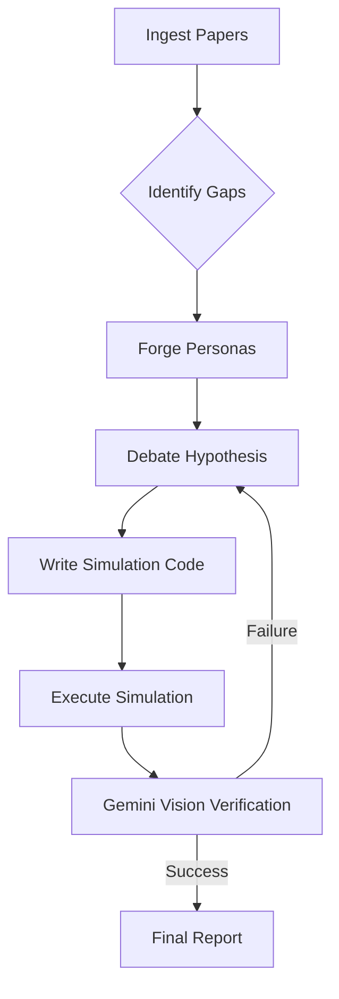

# Novelist - The Agentic Research Collective 🧠

> **Winner - Gemini API Developer Competition 2024 (Project Entry)**  
> *An autonomous scientific discovery engine that doesn't just read papers—it dreams, debates, and verifies new hypotheses.*


## 🌟 Introduction

Novelist is not another RAG chatbot. It is a **BDI (Beliefs, Desires, Intentions) Agentic Collective** designed to perform the actual work of a theoretical scientist.

It ingests thousands of papers, builds a mental model of the field, identifies "negative space" (unexplored gaps), and then **simulates a committee of expert personas**—a Skeptic, a Visionary, a Methodologist—to propose and rigorously debate new experimental hypotheses.

Crucially, it **verifies** these hypotheses by writing its own Python simulations and using **Gemini 1.5 Pro Vision** to inspect the resulting data plots, ensuring the math backs up the theory.

## 🚀 Key Features

### 1. The "Soul Forge" (Dynamic Personas)
Novelist uses Gemini to analyze your research topic and dynamically "hire" the perfect committee.
- *Researching Quantum Biology?* It spawns a "Quantum Physicist" and a "Molecular Biologist".
- *Researching Urban Planning?* It spawns a "Sociologist" and a "Civil Engineer".
These agents debate in real-time, catching each other's hallucinations.

### 2. Belief-Desire-Intention (BDI) Architecture
Unlike linear chains, Novelist maintains a cognitive state:
- **Beliefs**: "I know X about protein folding."
- **Desires**: "I want to find a mechanism that explains Y."
- **Intentions**: "I will run a simulation to test Z."
This allows it to pivot, backtrack, and dive deeper when it gets stuck.

### 3. SRSH (Stress-Responsive Semantic Hypermutation) 🧬
Inspired by the biological "SOS response" in bacteria, Novelist detects "knowledge stress" (gaps or contradictions in the literature). When stress is high, it triggers **SRSH**:
- It forks parallel "mutation streams" to explore radical, high-risk ideas.
- It forces a "Collision" between these streams to synthesize breakthrough hypotheses.
- It rewards "Semantic Distance" to prioritize novelty over safety.

### 4. Multimodal Verification (The "Gemini Loop")
We don't trust the text. Novelist:
1.  **Writes Code**: Generates a Python script to model the hypothesis (ODEs, Agent-Based Models).
2.  **Runs Simulation**: Executes the code in a sandboxed environment.
3.  **Vision Check**: Feeds the resulting plots/graphs back into **Gemini 3 Pro Vision** to ask: *"Does this data actually support the hypothesis?"*

### 5. Evolutionary Memory (The "Graveyard") 🪦
Novelist learns from failure. It maintains a persistent "Graveyard" of failed hypotheses and the reasons they were rejected.
- When generating new ideas, it queries this memory to avoid repeating past mistakes.
- It extracts "Anti-Patterns" from these failures to refine future prompts.

## 🛠️ Tech Stack

-   **Core Brain**: Google Gemini 3 Pro (Reasoning & Vision) & Flash (Speed).
-   **Architecture**: Custom BDI Loop (Python).
-   **Frontend**: React + Vite + Tailwind (Glassmorphism UI).
-   **Knowledge Base**: arXiv API + FAISS (Vector Store).
-   **Simulation**: NumPy / SciPy / Matplotlib.

## ⚡ Quick Start

### Prerequisites
- Python 3.10+
- Node.js 18+
- Gemini API Key

### Installation

1.  **Clone the Repo**
    ```bash
    git clone https://github.com/yourusername/novelist.git
    cd novelist
    ```

2.  **Backend Setup**
    ```bash
    python -m venv .venv
    .\.venv\Scripts\activate
    pip install -r requirements.txt
    ```

3.  **Frontend Setup**
    ```bash
    cd ui
    npm install
    ```

4.  **Environment Secrets**
    Create a `.env` file in the root:
    ```env
    GEMINI_API_KEY=your_key_here
    ```

### Running the App

1.  **Start the Brain (Backend)**
    ```bash
    # In terminal 1
    python -m uvicorn src.server:app --reload
    ```

2.  **Start the Face (Frontend)**
    ```bash
    # In terminal 2
    cd ui
    npm run dev
    ```

3.  Open `http://localhost:5173` and start your research session!

## 🧪 How It Works (The "Ralph" Engine)

The core engine, **Ralph**, follows a strict cognitive cycle:



## 🏆 Gemini Competition Integration

Novelist pushes the Gemini API to its limits:
-   **Long Context Window**: Ingests 50+ full-text papers into context for deep synthesis.
-   **System Instructions**: Uses complex system prompts to enforce distinct persona personalities (Skeptic vs. Optimist).
-   **Function Calling**: Structured output for extracting entities and writing code.
-   **Vision**: The critical "sanity check" loop where Gemini looks at charts to validate scientific claims.

## 📜 License

MIT License. Open Science for Everyone.
